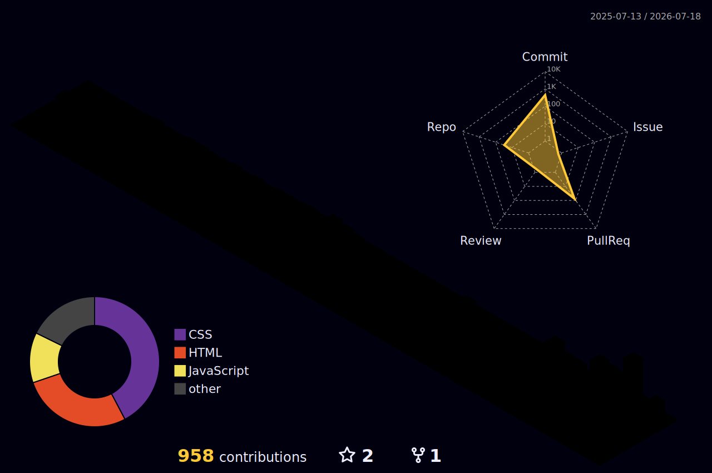

<!-- Header Section -->

  <!-- Dynamic capsule render for header banner -->
  
  
  

  <!-- Hits Counter -->
  

 

## 👤 About Me

안녕하세요, 디테일한 인터랙션과 픽셀 단위의 완결성을 고민하는 프론트엔드 개발자 **xoxo**입니다.

디자인 시안(Figma)의 정교한 디테일을 왜곡 없이 모던한 마크업과 코드(React 19, Next.js, Tailwind v4, SCSS)로 옮겨내는 것을 좋아합니다. 단순히 작동하는 페이지를 만드는 것을 넘어, 사용자가 직접 만지고 느끼는 프리미엄 디지털 경험과 매끄러운 웹 애니메이션을 만드는 데 집중하고 있습니다.

---

## 🛠️ Technology Orbit

### 🌐 Frontend

  
  
  
  
  
  
  
  
  
  
  
  
  
  
  
  
  
  
  
  
  
  
  
  

### 🗄️ Backend, Database & Cloud

  
  
  
  
  
  
  
  
  

### 🎨 Design & Tools

  
  
  
  
  
  
  
  
  
  
  
  
  
  

---

## 🚀 Projects & Showcases

  
💻 <b>Web Clones & Interactive Sites</b>

   
  

    <table border="0">
      <tr>
        <td align="center" valign="top" width="50%">
          
           
          포르쉐코리아 공식 웹사이트 고정밀 클론 코딩 (PDS & Astro 통합)
           
          🔒 Private Repo
            
        </td>
        <td align="center" valign="top" width="50%">
          
           
          페라리 공식 웹사이트 고해상도 비주얼 및 인터랙션 클론 코딩
           
          🔒 Private Repo
            
        </td>
      </tr>
      <tr>
        <td align="center" valign="top" width="50%">
          
           
          한국 코카-콜라 공식 브랜드 웹사이트 트렌디 레이아웃 클론 코딩
           
          🔒 Private Repo
            
        </td>
        <td align="center" valign="top" width="50%">
          
           
          삼성물산 공식 웹사이트 반응형 네비게이션 및 스크롤 인터랙션 클론
           
          🔒 Private Repo
            
        </td>
      </tr>
      <tr>
        <td align="center" valign="top" width="50%">
          
           
          BMW 코리아 공식 홈페이지 메가 메뉴 & 고해상도 그리드 클론 코딩
           
          🔒 Private Repo
            
        </td>
        <td align="center" valign="top" width="50%">
          
           
          애플 코리아 공식 홈페이지 프리미엄 레이아웃 & 네비게이션 클론
           
          🔒 Private Repo
            
        </td>
      </tr>
      <tr>
        <td align="center" valign="top" width="50%">
          
           
          스타벅스 코리아 공식 웹사이트 시즌 테마 & 메뉴 슬라이더 클론
           
          🔒 Private Repo
            
        </td>
        <td align="center" valign="top" width="50%">
          
           
          카카오맵 클론 코딩 (Rust Wasm Dijkstra 경로 최단 연산 고도화)
           
          🔒 Private Repo
            
        </td>
      </tr>
      <tr>
        <td align="center" valign="top" width="50%">
          
           
          KFC 딜리버리 및 메뉴 주문 레이아웃 픽셀 단위 정밀 클론 코딩
           
          🔒 Private Repo
            
        </td>
        <td align="center" valign="top" width="50%">
          
           
          토스 메인 & 금융 상품 소개 페이지 클론 코딩
           
          🔒 Private Repo
            
          
            
        </td>
      </tr>
      <tr>
        <td align="center" valign="top" width="50%">
          
           
          더뮤즈엔터테인먼트 공식 웹사이트 고해상도 클론 코딩
           
          🔒 Private Repo
            
          
            
        </td>
        <td align="center" valign="top" width="50%">
          
           
          비프의 푸른 바다 모험 - AI 인터랙티브 동화책
           
          🔒 Private Repo
            
          
            
        </td>
      </tr>
      <tr>
        <td align="center" valign="top" width="50%">
          
           
          Static Landing Page
           
          🔓 Public Repo
            
          
            
        </td>
        <td align="center" valign="top" width="50%">
          
           
          현대자동차그룹 메인 추천 기능 클론 코딩
           
          🔓 Public Repo
            
          
            
        </td>
      </tr>
      <tr>
        <td align="center" valign="top" width="50%">
          
           
          신세계백화점 공식 홈페이지 메인 페이지 고해상도 클론 코딩 (로컬 모의 API 및 VIP 로그인 시뮬레이션 통합)
           
          🔒 Private Repo
            
        </td>
        <td align="center" valign="top" width="50%">
          
           
          현대백화점 공식 포털 사이트 정밀 클론 코딩 (Happiness-Sans 로컬 폰트 다운로더 & 동적 API 미들웨어 모킹)
           
          🔒 Private Repo
            
        </td>
      </tr>
      <tr>
        <td align="center" valign="top" width="50%">
          
           
          리센느(RESCENE) 팬메이드 아카이브 웹 애플리케이션 (극장식 모달 플레이어, 넷플릭스 스타일 필터, 실시간 디바운스 검색 및 PWA 적용)
           
          🔒 Private Repo
            
        </td>
        <td align="center" valign="top" width="50%">
          
           
          하이브리드 3D 로그라이크 RPG 게임 (Three.js WebGL 에디션 & C 언어 Raylib 네이티브 에디션 구성, 돌진 타격 및 콤보 시스템 구현)
           
          🔒 Private Repo
            
        </td>
      </tr>
      <tr>
        <td align="center" valign="top" width="50%">
          
           
          React 19과 TS 기반 스포티파이 웹 플레이어 클론 코딩 (실시간 가사 동기화, 좋아요 상태 동기화, 동적 테마 그라데이션 및 SVG 마스코트 애니메이션)
           
          🔒 Private Repo
            
        </td>
        <td align="center" valign="top" width="50%">
          
           
          카카오뱅크 공식 홈페이지 메인 페이지 클론 코딩 (스크롤 방향 감지 헤더 & Swiper 슬라이더 인터랙션)
           
          🔓 Public Repo
            
        </td>
      </tr>
      <tr>
        <td align="center" valign="top" width="50%">
          
           
          스타필드 하남 공식 홈페이지 반응형 클론 코딩 (메가 메뉴 & Swiper 3D 입체 카드 효과)
           
          🔒 Private Repo
            
        </td>
        <td align="center" valign="top" width="50%">
          
           
          책과 함께 여유로운 시간을 보내는 공간, 슬로우 페이지 (GSAP 가로 스크롤 & 3D 북 플립 애니메이션 구현)
           
          🔓 Public Repo
            
          
            
        </td>
      </tr>
      <tr>
        <td align="center" valign="top" width="50%">
          
           
          SBS 아카데미 컴퓨터아트학원 안산점 풀스택 실무 애플리케이션 (React 프론트엔드와 FastAPI 백엔드 연동, 실시간 코드 플레이그라운드 수록)
           
          🔒 Private Repo
            
        </td>
        <td align="center" valign="top" width="50%">
        </td>
      </tr>
    </table>
  

  
🎓 <b>ESTsoft Frontend Bootcamp (FE 13) Projects</b>

   
  

    <table border="0">
      <tr>
        <td align="center" valign="top" width="50%">
          
           
          2nd Team Project - ROUNZ (Public Mirror)
           
          🔓 Public Repo
            
          
            
        </td>
        <td align="center" valign="top" width="50%">
          
           
          1st Team Project - EST CAMP (Public Mirror)
           
          🔓 Public Repo
            
          
            
        </td>
      </tr>
      <tr>
        <td align="center" valign="top" width="50%">
          
           
          Bootcamp News App Project
           
          🔒 Private Repo
            
          
            
        </td>
        <td align="center" valign="top" width="50%">
          
           
          Shopping Cart Practice
           
          🔓 Public Repo
            
          
            
        </td>
      </tr>
    </table>
  

  
🧪 <b>React & API Labs Archive</b>

   
  

        <table border="0">
      <tr>
        <td align="center" valign="top" width="50%">
          
           
          React Basic Review Mission 7
           
          🔓 Public Repo
            
        </td>
        <td align="center" valign="top" width="50%">
          
           
          React Basic Mission 5
           
          🔓 Public Repo
            
          
            
        </td>
      </tr>
      <tr>
        <td align="center" valign="top" width="50%">
          
           
          React Basic Mission 3
           
          🔓 Public Repo
            
          
            
        </td>
        <td align="center" valign="top" width="50%">
          
           
          React Basic Mission 2
           
          🔓 Public Repo
            
          
            
        </td>
      </tr>
      <tr>
        <td align="center" valign="top" width="50%">
          
           
          React Template Mission
           
          🔓 Public Repo
            
          
            
        </td>
        <td align="center" valign="top" width="50%">
          
           
          Kakao Map API Practice
           
          🔓 Public Repo
            
          
            
        </td>
      </tr>
      <tr>
        <td align="center" valign="top" width="50%">
          
           
          Weather API Practice
           
          🔓 Public Repo
            
        </td>
        <td align="center" valign="top" width="50%">
          
           
          React Hooks Study Starter Template
           
          🔓 Public Repo
            
        </td>
      </tr>
      <tr>
        <td align="center" valign="top" width="50%">
          
           
          React useState hook state management
           
          🔓 Public Repo
            
        </td>
        <td align="center" valign="top" width="50%">
          
           
          React Class Component Lifecycle & useEffect Hook
           
          🔓 Public Repo
            
        </td>
      </tr>
      <tr>
        <td align="center" valign="top" width="50%">
          
           
          React Context API global state management
           
          🔓 Public Repo
            
        </td>
        <td align="center" valign="top" width="50%">
          
           
          React AJAX data fetching with axios & fetch API
           
          🔓 Public Repo
            
        </td>
      </tr>
      <tr>
        <td align="center" valign="top" width="50%">
          
           
          Todo List application with LocalStorage persistence
           
          🔓 Public Repo
            
        </td>
        <td align="center" valign="top" width="50%">
          
           
          React Router navigation & page transitions
           
          🔓 Public Repo
            
        </td>
      </tr>
      <tr>
        <td align="center" valign="top" width="50%">
          
           
          Redux and global state management
           
          🔓 Public Repo
            
        </td>
        <td align="center" valign="top" width="50%">
          
           
          Swiper library integration in React
           
          🔓 Public Repo
            
        </td>
      </tr>
      <tr>
        <td align="center" valign="top" width="50%">
          
           
          React 19 컴포넌트, State & 이벤트 기초 실습
           
          🔓 Public Repo
            
          
            
        </td>
        <td align="center" valign="top" width="50%">
        </td>
      </tr>
    </table>
  

  
📂 <b>Portfolio Sandbox & Learning Lab</b>

   
  

    <table border="0">
      <tr>
        <td align="center" valign="top" width="50%">
          
           
          Next.js & Supabase Portfolio
           
          🔓 Public Repo
            
          
            
        </td>
        <td align="center" valign="top" width="50%">
          
           
          Vite React Portfolio
           
          🔓 Public Repo
            
          
            
        </td>
      </tr>
      <tr>
        <td align="center" valign="top" width="50%">
          
           
          HTML/CSS Practice
           
          🔓 Public Repo
            
        </td>
        <td align="center" valign="top" width="50%">
          
           
          Daily Coding Archive
           
          🔓 Public Repo
            
        </td>
      </tr>
      <tr>
        <td align="center" valign="top" width="50%">
          
           
          Git Learning Workflow
           
          🔓 Public Repo
            
        </td>
        <td align="center" valign="top" width="50%">
          
           
          Git Init Check
           
          🔓 Public Repo
            
        </td>
      </tr>
      <tr>
        <td align="center" valign="top" width="50%">
          
           
          Self-hosted GitHub Readme Stats API on Vercel
           
          🔓 Public Repo
            
          
            
        </td>
        <td align="center" valign="top" width="50%">
          
           
          GitHub Pull Shark Badge Archive
           
          🔓 Public Repo
            
        </td>
      </tr>
      <tr>
        <td align="center" valign="top" width="50%">
          
           
          React 19 + Tailwind v4 기반 3대 브랜드(ESSENCE LAB, ROM&ND, SERENIQ) 쇼케이스 갤러리 포트폴리오
           
          🔓 Public Repo
            
          
            
        </td>
        <td align="center" valign="top" width="50%">
        </td>
      </tr>
    </table>
  

## ⚡ Recent Activity

<!-- START_SECTION:activity -->

- 🔨 [`Squarespace-Foundations/main`](https://github.com/xoxoworld/Squarespace-Foundations/tree/main)에 커밋 푸시 (2026년 7월 21일)
- 🔨 [`Basic-Review-Mission-8/main`](https://github.com/xoxoworld/Basic-Review-Mission-8/tree/main)에 커밋 푸시 (2026년 7월 18일)
- 🔨 [`xoxoworld/main`](https://github.com/xoxoworld/xoxoworld/tree/main)에 커밋 푸시 (2026년 7월 16일)
- 🔨 [`React-Basic-Review-Mission-7-/main`](https://github.com/xoxoworld/React-Basic-Review-Mission-7-/tree/main)에 커밋 푸시 (2026년 7월 8일)
- 🔨 [`NODEBOX/main`](https://github.com/xoxoworld/NODEBOX/tree/main)에 커밋 푸시 (2026년 7월 4일)

<!-- END_SECTION:activity -->

## 📊 GitHub Insights

  <table border="0">
    <tr>
      <td>
        
      </td>
      <td>
        
      </td>
    </tr>
  </table>
  
   
  
  

  <!-- 3D Contribution Graph -->
  

---

## 📬 Contact & Channels

  

